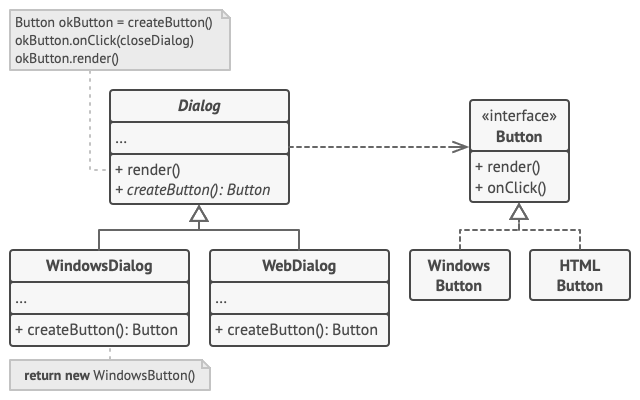

# Pseudocódigo
Este ejemplo ilustra cómo puede utilizarse el patrón Factory Method para crear elementos de interfaz de usuario (UI) multiplataforma sin acoplar el código cliente a clases UI concretas.

 ## Ejemplo del diálogo multiplataforma.

La clase base de diálogo utiliza distintos elementos UI para representar su ventana. En varios sistemas operativos, estos elementos pueden tener aspectos diferentes, pero su comportamiento debe ser consistente. Un botón en Windows sigue siendo un botón en Linux.

Cuando entra en juego el patrón Factory Method no hace falta reescribir la lógica del diálogo para cada sistema operativo. Si declaramos un patrón Factory Method que produce botones dentro de la clase base de diálogo, más tarde podremos crear una subclase de diálogo que devuelva botones al estilo de Windows desde el Factory Method. Entonces la subclase hereda la mayor parte del código del diálogo de la clase base, pero, gracias al Factory Method, puede representar botones al estilo de Windows en pantalla.

Para que este patrón funcione, la clase base de diálogo debe funcionar con botones abstractos, es decir, una clase base o una interfaz que sigan todos los botones concretos. De este modo, el código sigue siendo funcional, independientemente del tipo de botones con el que trabaje.

Por supuesto, también se puede aplicar este sistema a otros elementos UI. Sin embargo, con cada nuevo método de fábrica que añadas al diálogo, más te acercarás al patrón Abstract Factory. No temas, más adelante hablaremos sobre este patrón.

La clase creadora declara el método fábrica que debe devolver
un objeto de una clase de producto. Normalmente, las
subclases de la creadora proporcionan la implementación de
este método.

Los creadores concretos sobrescriben el método fábrica para
cambiar el tipo de producto resultante.

    class WindowsDialog extends Dialog is
            method createButton():Button is
                return new WindowsButton()

    class WebDialog extends Dialog is
        method createButton():Button is
            return new HTMLButton()

La interfaz de producto declara las operaciones que todos los productos concretos deben implementar.

        interface Button is
            method render()
            method onClick(f)

Los productos concretos proporcionan varias implementaciones
 de la interfaz de producto.

    class WindowsButton implements Button is
    method render(a, b) is
        // Representa un botón en estilo Windows.
    method onClick(f) is
Vincula un evento clic de OS nativo.

    class HTMLButton implements Button is
    method render(a, b) is
        Devuelve una representación HTML de un botón.
    method onClick(f) is
        Vincula un evento clic de navegador web.

class Application is
    field dialog: Dialog
 La aplicación elige un tipo de creador dependiendo de la configuración actual o los ajustes del entorno. 

     method initialize() is
        config = readApplicationConfigFile()

        if (config.OS == "Windows") then
            dialog = new WindowsDialog()
        else if (config.OS == "Web") then
            dialog = new WebDialog()
        else
            throw new Exception("Error! Unknown operating system.")
            
El código cliente funciona con una instancia de un
creador concreto, aunque a través de su interfaz base.
Siempre y cuando el cliente siga funcionando con el creador a través de la interfaz base, puedes pasarle cualquier subclase del creador.

     method main() is
        this.initialize()
        dialog.render()

